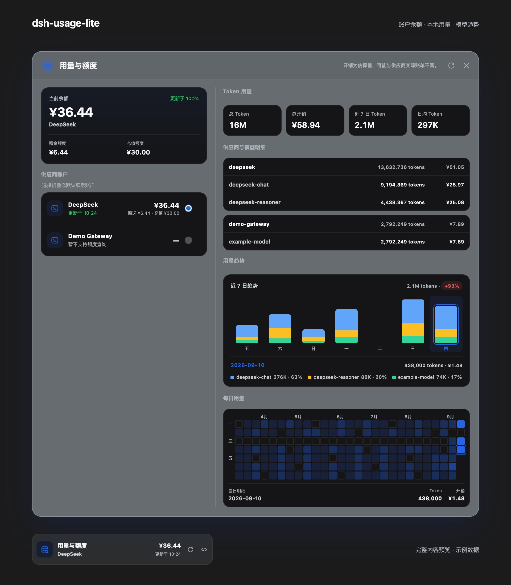

# dsh-usage-lite

[](https://github.com/deepseek-ai/deepseek-harness)
[](LICENSE)
[](https://github.com/ericw0315/dsh-usage-lite/stargazers)

在 [DeepSeek Harness](https://github.com/deepseek-ai/deepseek-harness) Web 侧边栏查看账户余额，展开同一个面板即可浏览本地 Token 用量、模型构成与每日趋势。

Compact provider balances and local token-usage analytics for the DeepSeek Harness Web UI.


> 由当前 `lib/client.js`、DSH 主题与图标实际渲染，使用固定示例数据；金额、账户和用量均为演示内容。为便于阅读，截图展开了面板的滚动区域。

<details>
<summary>查看深色界面</summary>



</details>

## 功能一览

- **侧边栏余额入口**：显示默认账户、余额与更新时间，可直接刷新或隐藏金额；收起侧边栏后保留图标入口。
- **余额与用量并排展示**：宽屏下左侧为余额和供应商账户，右侧为用量与趋势；窄屏自动切换为单列，内容可滚动。
- **四项用量指标**：总 Token、总估算开销、近 7 日 Token、近 7 日日均 Token。
- **供应商与模型明细**：按供应商分组列出各模型的 Token 和估算开销。
- **近 7 日堆叠柱状图**：按模型区分颜色，展示每日构成和相对前 7 日的用量变化；点击某一天查看模型 Token 与占比。
- **27 周每日热力图**：按用量深浅展示活跃情况，与柱状图联动选择日期，查看当日 Token 和估算开销。
- **本地会话聚合**：合并内存与持久化会话，识别普通回复和上下文压缩等调用的模型归属，并对复制到子代理会话的历史调用去重。
- **跟随宿主外观**：支持中文、英文以及浅色、深色主题，无需独立配置页面或后台服务。

## 安装与更新

需要已安装、能够运行 `dsh web`，且支持 profile 插件与 Web 客户端扩展的 DeepSeek Harness 环境。

```bash
# 安装到 Web profile
dsh plugin --profile web add dsh-usage-lite

# 更新
dsh plugin --profile web update dsh-usage-lite

# 卸载
dsh plugin --profile web remove dsh-usage-lite
```

安装或更新后重启 `dsh web`，再在浏览器中硬刷新。入口位于侧边栏底部的操作区。

## 使用

1. 点击侧边栏的「用量与额度」打开面板。
2. 在左侧查看当前余额、赠金额度、充值额度和供应商账户。支持余额查询的账户可以设为折叠态默认账户。
3. 在右侧查看累计用量与模型明细。点击近 7 日柱状图，查看所选日期的模型构成；点击热力图，查看历史某一天的用量。
4. 点击刷新按钮重新拉取余额和本地统计；点击侧边栏的金额显隐按钮切换余额显示。

点击关闭按钮、面板外部或按 `Esc` 可收起面板。默认账户与余额显隐偏好保存在当前浏览器的 `localStorage` 中。面板首次加载时自动拉取数据，后续通过刷新按钮更新。

刷新失败时，当前页面会保留最近一次成功获得的余额及更新时间，并显示失败状态。账户切换只影响余额展示，用量始终聚合所有供应商。

## 供应商与凭据

插件复用 DSH 的设置和 credentials 服务：

| 来源 | 用途 |
| --- | --- |
| `llm-deepseek` | DeepSeek 官方账户的 `baseURL` 与 `apiKeyEnv` |
| `llm-pi-ai.providers` | 其他供应商的账户 ID 与展示名称 |
| DSH credentials | 在服务端解析 DeepSeek API Key 引用 |

DeepSeek 默认使用 `https://api.deepseek.com` 与凭据引用 `DEEPSEEK_API_KEY`。账户列表保留 DeepSeek 条目；凭据缺失时显示「未配置访问凭据」。额外供应商来自 `llm-pi-ai.providers`。

例如使用 DSH 本地凭据文件（默认 `~/.dsh/.credentials.yaml`，自定义 `DSH_HOME` 时使用对应目录）：

```yaml
DEEPSEEK_API_KEY: sk-your-key-here
```

若 `llm-deepseek.apiKeyEnv` 使用了其他名称，请配置相同名称的凭据。插件每次查询余额都会重新解析该引用。

| 能力 | DeepSeek 官方账户 | 其他供应商 |
| --- | --- | --- |
| 账户列表 | 支持 | 支持，读取 DSH 配置 |
| 本地 Token 统计 | 支持 | 支持，取决于会话事件中的 usage 信息 |
| 余额、赠金与充值额度 | 支持 | 暂不支持 |
| 折叠态默认账户 | 支持 | 暂不可选 |

当前只有 `deepseek-official` 账户启用余额适配器，通过配置的 `baseURL` 请求 `GET /user/balance`。把其他供应商配置为兼容 DeepSeek 的地址，不会自动为其启用余额查询。

## 统计口径

### 数据从哪里来

统计来自 DSH 当前加载的会话与本地持久化会话事件中的 `data.usage`，不读取供应商账单 API，也不依赖账户余额反推用量。

- Token 为输入、输出、缓存读取和缓存写入四项之和。
- 优先从 `data.message.source` 识别模型与供应商，同时兼容上下文压缩等调用的 `data.model`、`data.provider` 字段。缺少来源信息时会尝试从模型名称推断，仍无法识别则归入 `unknown`。
- 已在内存中读取的会话不再重复读取磁盘副本；复制到子代理日志的历史调用，按时间戳、Token 数量与模型/供应商信息组成的指纹去重。没有数值时间戳的事件不参与调用指纹去重。
- 兼容 `snapshotEvents()`、持久化会话 `list()` / `open()` 接口，以及旧版的 `events`、`listSnapshots()` / `readFrom()` 接口。单个持久化会话读取失败会被跳过，其他会话仍可统计。

因此，本地事件缺失、清理或无法读取时，统计可能不完整；本地总量也可能与供应商账单不同。

### 时间范围与图表

| 项目 | 当前规则 |
| --- | --- |
| 总 Token、总开销、供应商/模型明细 | 所有可读取会话的累计值，不限于热力图的 27 周 |
| 日期边界 | 使用 UTC 日期聚合 |
| 趋势结束日期 | 最近一条用量记录的日期；没有记录时使用当前 UTC 日期 |
| 近 7 日 | 包含结束日期的连续 7 天，无用量日期计为 0 |
| 日均 Token | 近 7 日 Token ÷ 7，包含零用量日 |
| 变化百分比 | 与紧邻的前 7 日总量比较；前期为 0 时显示「无对比」 |
| 模型颜色 | 按近 7 日用量排序，窗口内保持一致；前 5 个模型单独展示，其余合并为「其他」 |
| 同名模型 | 柱状图跨供应商合并同名模型，明细表仍按供应商分别列出 |
| 热力图 | 展示 27 周，周一开始；结束日期之后的格子不可选择 |

柱状图和热力图共享所选日期。选择近 7 日范围外的热力图日期时，下方更新当日汇总，柱状图仍保留原来的 7 日窗口。选择日期不会过滤累计指标或供应商/模型明细。

### 开销估算

以下是**当前代码内置的估算价格**，单位为人民币 / 100 万 Token，并非实时官方报价：

| 模型 | 输入 | 输出 | 缓存读取 | 缓存写入 |
| --- | ---: | ---: | ---: | ---: |
| `deepseek-chat` | ¥2 | ¥8 | ¥0.5 | ¥2 |
| `deepseek-reasoner` | ¥4 | ¥16 | ¥1 | ¥4 |

**所有未匹配的模型，包括其他供应商模型，当前均回退到 `deepseek-chat` 价格估算。** 插件未接入实时价格、汇率、折扣或供应商账单规则，请以供应商实际账单为准。余额按上游返回币种显示，用量开销固定以 CNY 展示。

## 隐私与访问范围

- API Key 在服务端通过 DSH credentials 解析，并用于所配置 DeepSeek 余额接口的请求；不作为字段返回浏览器。
- 插件不上传会话内容或用量记录，没有遥测或远程分析服务。
- `/api/usage-lite/summary` 与 `/api/usage-lite/detail` 只接受 `GET` 请求，并同时检查连接来源和 `Host`：来源必须为本机回环地址，`Host` 必须是 `localhost` 或回环地址。
- 余额显隐是当前浏览器的展示偏好，不改变服务端返回数据。

通过局域网 IP 或自定义域名直接访问时，即使 DSH Web 可以打开，插件接口也可能返回 `403`。请通过符合上述条件的本机地址访问。

## 常见问题

### DeepSeek 显示「未配置访问凭据」

检查 `llm-deepseek.apiKeyEnv`（默认 `DEEPSEEK_API_KEY`）是否能被 DSH credentials 解析，然后点击刷新。若通过进程环境变量配置 Key，需要让正在运行的 `dsh web` 进程取得该变量。

### 其他供应商有 Token 用量，但没有余额

两项能力使用不同数据源：用量读取本地事件，余额需要单独的供应商适配器。目前只有 DeepSeek 官方账户支持余额查询。

### 最近没有对话，为什么「近 7 日」仍显示历史用量

当前窗口以最后一条用量记录的日期结束，不会随日历自动向今天移动。可以通过柱状图提示或热力图所选日期确认具体日期。

### 为什么用量明细为空或出现 `unknown`

没有带 `data.usage` 的事件时，无法生成统计。事件中缺少模型或供应商来源时，归属可能显示为 `unknown`。历史日志被删除或读取失败，也会导致统计缺失。

### 刷新失败或显示旧余额

检查 DeepSeek 凭据、`baseURL` 和网络连通性；浏览器网络面板中若插件接口返回 `403`，检查访问地址是否符合本机限制。失败后保留的金额是当前页面最近一次成功值，请结合状态与更新时间判断。

### 安装或更新后没有变化

确认安装到了运行 `dsh web` 所用的 profile，然后重启 `dsh web` 并硬刷新浏览器，确保加载了新客户端资源。

## 开发与验证

```bash
git clone https://github.com/ericw0315/dsh-usage-lite.git
cd dsh-usage-lite
npm ci
npm test
npm run check
```

| 文件 / 命令 | 作用 |
| --- | --- |
| `lib/index.js` | 供应商发现、余额查询、会话读取与去重、Token 聚合、本机 HTTP 接口 |
| `lib/client.js` | 侧边栏入口、双列面板、模型趋势、热力图和中英文文案 |
| `cordis.patch.yml` | DSH bundle 注册声明 |
| `npm test` | 验证 bundle 声明、服务端统计与访问限制、客户端渲染与交互逻辑 |
| `npm run check` | JavaScript 语法检查 |

### 重新生成 README 预览图

`scripts/render-readme.mjs` 直接渲染当前客户端，复用 DSH 的主题与图标；示例用量由当前服务端聚合逻辑生成，不读取个人会话或凭据。输出浅色和深色两张图片。

准备 Playwright 及 Chromium（仅生成文档图片时需要）：

```bash
npm install --no-save --package-lock=false playwright
npx playwright install chromium
```

指定本地 DSH 的主题 CSS 和已构建的图标模块：

```bash
DSH_THEME_CSS=/path/to/deepseek-harness/packages/client/ui-theme/src/styles/design-platform.css \
DSH_PRIMITIVES_JS=/path/to/node_modules/@deepseek-ai/dsh-client-ui-primitives/lib/index.js \
node scripts/render-readme.mjs
```

如需使用其他位置的 Playwright 或浏览器，可设置 `PLAYWRIGHT_MODULE`（模块入口绝对路径）与 `CHROMIUM_EXECUTABLE`（浏览器可执行文件绝对路径）。

## 贡献

欢迎通过 [GitHub Issues](https://github.com/ericw0315/dsh-usage-lite/issues) 反馈问题或提交 Pull Request。行为改动请补充对应验证，运行 `npm test` 与 `npm run check`；界面变化时同步更新预览图。请勿提交真实凭据、个人会话或用量数据。

可扩展方向包括更多供应商余额适配器，以及更完整、易维护的估算价格表。

## License

[MIT](LICENSE) © dsh-usage-lite contributors
