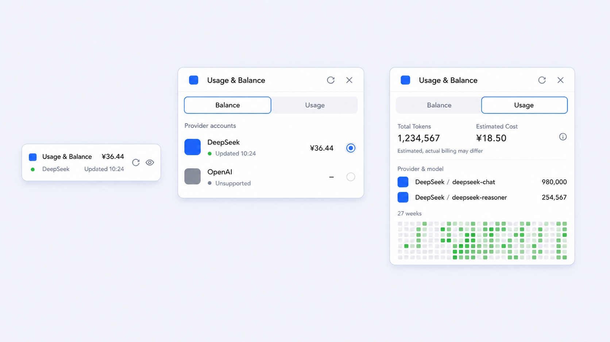

# dsh-usage-lite

[](https://github.com/deepseek-ai/deepseek-harness)
[](LICENSE)
[](https://github.com/ericw0315/dsh-usage-lite/stargazers)

为 [DeepSeek Harness](https://github.com/deepseek-ai/deepseek-harness) Web 界面提供简洁、优雅的余额与 Token 用量面板。

Compact provider balances and local token-usage analytics for the DeepSeek Harness Web UI.



> 界面示意图：直观展示折叠态余额、供应商账户与聚合用量；具体文字和数据以实际运行环境为准。

## 为什么选择 Lite

`dsh-usage-lite` 只保留高频信息和必要操作：侧边栏快速查看余额，展开后查看供应商账户与近半年用量。没有独立后台、复杂配置页或遥测服务。

- **一眼查看余额**：侧边栏直接显示所选供应商、当前余额和上次拉取时间。
- **自动发现供应商**：读取 DSH 已配置的模型供应商并逐行展示，超出高度后在列表内滚动。
- **聚合本地用量**：按日期、供应商和模型汇总 Token，并用 27 周热力图展示趋势。
- **明确能力边界**：当前仅查询 DeepSeek 余额；其他供应商仍会展示并参与 Token 统计。
- **隐私优先**：凭据只在服务端解析，不会返回浏览器；HTTP 接口仅接受本机回环请求。
- **中英文界面**：跟随 DSH Web 的语言环境。

## 功能

### 余额

- 展示 DSH 中已配置的供应商账户。
- 查询 DeepSeek 当前余额、赠送额度和充值额度。
- 支持刷新、隐藏余额以及选择折叠态默认账户。
- 刷新失败时保留最近一次成功余额和拉取时间。
- 不支持余额查询的供应商会明确标记，且不能设为折叠态默认账户。

### 用量

- 汇总输入、输出、缓存读取和缓存写入 Token。
- 按供应商与模型展示 Token 和估算开销。
- 展示最近 27 周的每日用量热力图。
- 点击日期查看当日 Token 与估算开销。
- 用量视角聚合所有供应商，不受余额页默认账户选择影响。

## 安装

需要已安装并能够运行 `dsh web` 的 DeepSeek Harness 环境。

```bash
dsh plugin --profile web add dsh-usage-lite
```

安装后重启正在运行的 `dsh web`，并在浏览器中硬刷新。入口会出现在侧边栏设置项上方。

### 更新

```bash
dsh plugin --profile web update dsh-usage-lite
```

更新后同样需要重启 `dsh web` 并硬刷新浏览器，以避免旧客户端资源缓存。

### 卸载

```bash
dsh plugin --profile web remove dsh-usage-lite
```

## 配置

插件不维护独立供应商配置，而是读取 DSH 已有设置：

- 官方 DeepSeek 配置来自 `llm-deepseek`。
- 其他模型供应商来自 `llm-pi-ai.providers`。
- DeepSeek 默认凭据引用为 `DEEPSEEK_API_KEY`；若 provider 配置了 `apiKeyEnv`，则使用该引用。

例如在 DSH 凭据文件中配置：

```yaml
# ~/.dsh/.credentials.yaml
DEEPSEEK_API_KEY: sk-your-key-here
```

不要将真实 API Key 提交到 Git、公开 Issue 或日志中。

## 供应商支持

当前版本按“一个供应商一个适配器文件”组织，所有适配器都位于 `lib/providers/`：

- `lib/providers/deepseek.js`
- `lib/providers/openai.js`
- `lib/providers/anthropic.js`
- `lib/providers/gemini.js`
- `lib/providers/qwen.js`
- `lib/providers/zhipu.js`
- `lib/providers/minimax.js`

能力矩阵如下：

| 供应商 | 自动发现与列表展示 | 本地 Token 聚合 | 公共牌价估算 | 余额请求 | 折叠态默认账户 | 估算币种 |
| --- | --- | --- | --- | --- | --- | --- |
| DeepSeek | 支持 | 支持 | 支持 | 支持 | 支持 | CNY / USD |
| OpenAI | 支持 | 支持 | 支持 | 不支持 | 不支持 | USD |
| Anthropic | 支持 | 支持 | 支持 | 不支持 | 不支持 | USD |
| Gemini | 支持 | 支持 | 支持 | 不支持 | 不支持 | USD |
| Qwen | 支持 | 支持 | 支持 | 不支持 | 不支持 | CNY |
| 智谱 Zhipu | 支持 | 支持 | 支持 | 不支持 | 不支持 | CNY |
| MiniMax | 支持 | 支持 | 支持 | 不支持 | 不支持 | CNY |

- 当前只有 DeepSeek 会发起真实余额请求，调用 provider `baseURL` 下的 `/user/balance`。
- 其余六个供应商不会请求余额接口，只会展示账户、聚合本地 Token，并按公开牌价做估算。
- 折叠态默认账户当前只允许选择 DeepSeek，因为它是唯一能返回实时余额的适配器。

## 数据来源与估算

Token 数据来自 DSH 当前会话和本地持久化会话事件，不来自供应商账单 API。插件读取事件中的 `data.usage` 和模型来源信息，并按 UTC 日期聚合。

估算规则：

- 所有供应商都只做本地聚合和本地估算，不会向账单系统补拉历史费用。
- 除下述两个 DeepSeek 向后兼容估算外，价格来自公开牌价快照，验证日期为 `2026-08-26`。
- `deepseek-chat` 与 `deepseek-reasoner` 沿用项目原有估算价，并标记为 `legacy-project-price`，不是当前 DeepSeek 公开牌价：前者每百万 Token 的输入/输出/缓存读取/缓存写入分别为 CNY `2/8/0.5/2`，后者为 CNY `4/16/1/4`。
- 原始币种保持不变，CNY 和 USD 会分别展示，不做自动换汇或统一折算。
- 未知模型绝不会回退到别的模型价格；当没有明确牌价时直接返回 `status: "unknown"`，并把相关 Token 记入 `unpricedTokens`。
- `status: "partial"` 有两种需要区分的语义。Qwen Plus/Turbo 等缺少服务模式细节时属于“基于假设的部分估算”：输入和输出 Token 仍按标准模式牌价计入金额，`unpricedTokens` 可以为 `0`。缓存写入等 Token 类别没有可用牌价时属于“排除部分 Token 的估算”：金额不包含这些 Token，并把它们计入 `unpricedTokens`。
- 某些适配器即使仍存在账单上下文备注，也会在公开牌价足以覆盖当前全部 Token 时返回 `status: "priced"`、`unpricedTokens: 0`，并把 `pricingBasis` 标记为 `current-public-price-partial-context`。这表示金额已按公开费率计入，但仍带有上下文 caveat，而不是有 Token 被排除。
- 首个公开版本只覆盖文本生成 Token 费用，不包含图像、音频、视频、Embedding、重排、联网工具、批处理折扣、税费或其他账单侧附加项。
- 公开牌价快照与兼容估算都由项目人工维护；实际结算、优惠、赠送、离峰活动和发票口径始终以供应商账单为准。

已内置的公开牌价来源（不包含上述两个 `legacy-project-price` 兼容估算）：

- DeepSeek: <https://api-docs.deepseek.com/quick_start/pricing/>（`2026-08-26`）
- OpenAI: <https://developers.openai.com/api/docs/pricing>（`2026-08-26`）
- Anthropic: <https://platform.claude.com/docs/en/about-claude/pricing>（`2026-08-26`）
- Gemini: <https://ai.google.dev/gemini-api/docs/pricing>（`2026-08-26`）
- Qwen: <https://help.aliyun.com/zh/model-studio/model-pricing>（`2026-08-26`）
- 智谱 Zhipu: <https://bigmodel.cn/pricing>（`2026-08-26`）
- MiniMax: <https://platform.minimaxi.com/docs/guides/pricing-paygo>（`2026-08-26`）

## 适配器约定

新增供应商时，请为每个供应商单独新增一个 `lib/providers/<provider>.js` 文件，并默认导出同一份六成员契约：

1. `id`
2. `capabilities`
3. `matches(config)`
4. `normalizeConfig(config)`
5. `fetchBalance(context)`
6. `resolvePrice(context)`

说明：

- `capabilities.balance` 必须与 `fetchBalance` 是否存在保持一致。
- `capabilities.pricing` 必须与 `resolvePrice` 是否存在保持一致。
- 当前七个内置适配器中，只有 DeepSeek 同时实现余额与定价；其余六个只实现定价。
- `scripts/test-bundle.mjs` 会校验 `lib/providers/` 下七个适配器都被打包，并要求本文档覆盖 `unpricedTokens` 与供应商能力边界。

## 隐私与安全

- API Key 通过 DSH credentials 在服务端解析，不会发送到插件客户端。
- 浏览器只接收展示所需的供应商状态、余额和聚合用量。
- 插件服务端接口只接受本机回环地址发起的 `GET` 请求。
- 除查询已配置 DeepSeek `baseURL` 的余额接口外，插件不向第三方服务上传数据。
- 项目不包含遥测、用户跟踪或远程分析服务。

如发现安全问题，请优先使用 GitHub 的私密安全报告功能，或在不包含凭据、地址和原始响应的前提下联系维护者。不要在公开 Issue 中披露可利用细节或任何密钥。

## 常见问题

### DeepSeek 显示“未配置访问凭据”

确认 `llm-deepseek` 的 `apiKeyEnv` 与 `~/.dsh/.credentials.yaml` 中的键一致，然后重启 `dsh web`。

### 有供应商但没有余额

当前仅 DeepSeek 支持余额查询。其他供应商会显示“暂不支持额度查询”，但仍可出现在用量聚合中。

### 没有供应商或模型用量

用量依赖 DSH 会话事件中的 `data.usage` 和模型来源字段。尚未产生对话用量、历史事件未持久化或上游未返回 usage 时，对应明细为空。

### 更新后界面没有变化

重启 `dsh web`，然后对浏览器执行硬刷新，确保客户端没有继续使用旧插件资源。

## 开发

```bash
git clone https://github.com/ericw0315/dsh-usage-lite.git
cd dsh-usage-lite
npm install
npm test
npm run check
```

- `npm test`：验证 bundle 声明、服务端聚合与客户端渲染行为。
- `npm run check`：检查 JavaScript 语法。

核心文件：

- `lib/index.js`：供应商发现、余额查询、Token 聚合和本机 HTTP 接口。
- `lib/client.js`：侧边栏入口、余额列表、用量详情和交互状态。
- `cordis.patch.yml`：DSH bundle 注册声明。

## 贡献

Issue 和 Pull Request 都欢迎。提交改动前请：

1. 保持实现聚焦，避免为少量信息引入复杂配置或大型依赖。
2. 为行为变化补充测试，并运行 `npm test` 与 `npm run check`。
3. 在 PR 中说明用户可见变化、验证方式和兼容性影响。
4. 不提交真实凭据、个人用量、供应商原始响应或本地 DSH 配置。

问题反馈请使用 [GitHub Issues](https://github.com/ericw0315/dsh-usage-lite/issues)。

## 路线图

- 增加更多供应商余额适配器。
- 让估算价格表更易维护和扩展。
- 在不增加使用负担的前提下完善异常状态与兼容性。

路线图不代表交付承诺；具体优先级以社区反馈和实际维护成本为准。

## License

[MIT](LICENSE) © dsh-usage-lite contributors
